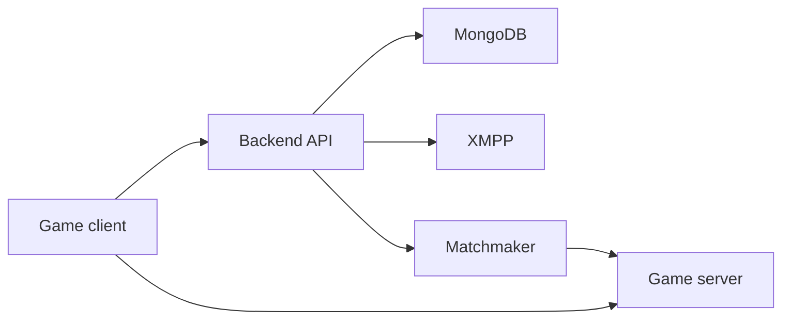

# Dream

Dream is the backend and game-server workspace for the project. Keep launcher code in the separate launcher repo; this repo is for server-side work.

There are two active parts here:

| Path | What it is |
| --- | --- |
| `LawinServerV2-main/` | Node.js backend with auth, profiles, friends, store routes, XMPP, matchmaker, and launcher-facing endpoints |
| `Project-Reboot-3.0-master/` | Visual Studio C++ game-server workspace and DLL project |
| `docs/` | Setup notes, architecture notes, and roadmap |

This repo should not contain game files, Epic Games assets, real user data, Discord tokens, passwords, or private keys. Imported third-party code keeps its original license and authorship.

## Run The Backend Locally

```powershell
cd D:\ProjectDream\LawinServerV2-main
npm install
npm start
```

Expected startup shape:

```text
BACKEND: App started listening on port 8080
BOT: Discord bot disabled because DISCORD_BOT_TOKEN is not set.
XMPP: XMPP and Matchmaker started listening on port 80
BACKEND: App successfully connected to MongoDB!
```

MongoDB must be running before the backend can finish booting.

## Backend Environment

Create `LawinServerV2-main/.env` for local secrets and machine-specific values:

```env
PORT=8080
MONGODB_URI=mongodb://127.0.0.1/lawindb
DISCORD_BOT_TOKEN=
DISCORD_CLIENT_ID=
DISCORD_CLIENT_SECRET=
JWT_SECRET=
```

Keep `JWT_SECRET` stable. If it changes, saved launcher sessions become invalid and users must log in again.

## Launcher API

The desktop launcher talks to the backend under `/launcher/api`.

| Method | Path | Purpose |
| --- | --- | --- |
| `GET` | `/launcher/api/status` | Reports backend, MongoDB, XMPP, and matchmaker state |
| `GET` | `/launcher/api/auth/discord/start` | Creates the Discord OAuth URL for the launcher |
| `POST` | `/launcher/api/auth/discord/callback` | Exchanges the Discord OAuth code for a Dream launcher session |
| `POST` | `/launcher/api/auth/discord/exchange` | Converts a valid launcher session into a one-time game exchange code |

Discord OAuth credentials belong in the backend `.env`. Do not put the Discord client secret in the desktop launcher.

## Game Server Build

Open this solution in Visual Studio:

```text
D:\ProjectDream\Project-Reboot-3.0-master\Project Reboot 3.0.sln
```

Use `Release | x64` first unless you are debugging a specific issue. The expected DLL output is:

```text
D:\ProjectDream\Project-Reboot-3.0-master\x64\Release\Project Reboot 3.0.dll
```

## Repository Map



## Docs

- [docs/SETUP_LOCAL.md](docs/SETUP_LOCAL.md) - local setup.
- [docs/ARCHITECTURE.md](docs/ARCHITECTURE.md) - component overview.
- [docs/ROADMAP.md](docs/ROADMAP.md) - active plan.
- [CONTRIBUTING.md](CONTRIBUTING.md) - repo workflow.
- [SECURITY.md](SECURITY.md) - secrets and vulnerability handling.
- [NOTICE.md](NOTICE.md) - third-party code notice.
