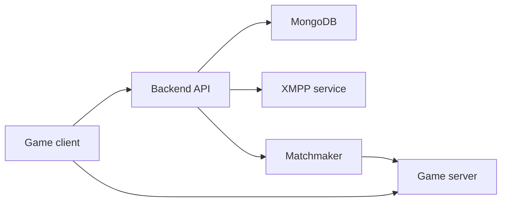

# Dream

Dream is a backend and game server workspace for old Fortnite server-side infrastructure experiments.

This repository currently contains two active components:

| Path | Purpose | Status |
| --- | --- | --- |
| `LawinServerV2-main/` | Node.js backend: auth endpoints, profiles, friends, store, XMPP, matchmaking endpoints | Runs locally with MongoDB |
| `Project-Reboot-3.0-master/` | C++ game server workspace / Visual Studio DLL project | Imported, build verification pending |
| `docs/` | Architecture, setup, and roadmap documentation | Active |

Important boundaries:

- No Fortnite game files are stored in this repository.
- No Epic Games assets are stored in this repository.
- No private keys, Discord tokens, passwords, or real user data should be committed.
- Third-party code keeps its original license and authorship.

## Local Backend Start

```powershell
cd D:\ProjectDream\LawinServerV2-main
npm install
npm start
```

Expected output:

```text
BACKEND: App started listening on port 8080
BOT: Discord bot disabled because DISCORD_BOT_TOKEN is not set.
XMPP: XMPP and Matchmaker started listening on port 80
BACKEND: App successfully connected to MongoDB!
```

## Launcher Endpoints

The backend exposes launcher-facing endpoints under `/launcher/api`.

| Method | Path | Purpose |
| --- | --- | --- |
| `GET` | `/launcher/api/status` | Returns backend, MongoDB, XMPP, and matchmaker health for the desktop launcher |
| `GET` | `/launcher/api/auth/discord/start` | Creates a Discord OAuth login URL for the desktop launcher |
| `POST` | `/launcher/api/auth/discord/callback` | Exchanges Discord OAuth code for a short-lived Dream launcher session |
| `POST` | `/launcher/api/auth/discord/exchange` | Converts a Dream launcher session into a short-lived exchange code for game launch |

Discord OAuth credentials are backend secrets. Put them in `LawinServerV2-main/.env`; do not store a Discord client secret in the desktop launcher.

```env
DISCORD_CLIENT_ID=
DISCORD_CLIENT_SECRET=
JWT_SECRET=
```

`JWT_SECRET` must stay the same between backend restarts, otherwise saved launcher sessions become invalid and the user has to sign in again.

## Game Server Build

Open this solution in Visual Studio 2022:

```text
D:\ProjectDream\Project-Reboot-3.0-master\Project Reboot 3.0.sln
```

Use `Release | x64` first unless a specific debug configuration is needed.

## Architecture



## Documentation

- [docs/SETUP_LOCAL.md](docs/SETUP_LOCAL.md) - local environment setup.
- [docs/ARCHITECTURE.md](docs/ARCHITECTURE.md) - component overview.
- [docs/ROADMAP.md](docs/ROADMAP.md) - active development plan.
- [CONTRIBUTING.md](CONTRIBUTING.md) - contribution rules.
- [SECURITY.md](SECURITY.md) - secret and vulnerability handling.
- [NOTICE.md](NOTICE.md) - third-party code notice.
