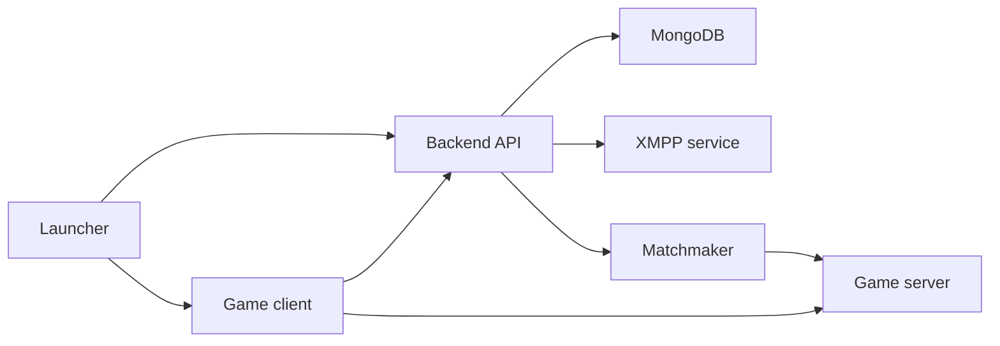

# Dream

Dream - рабочий репозиторий проекта по восстановлению инфраструктуры для старых версий Fortnite: backend, launcher и game server.

Проект сейчас находится на стадии первичной сборки кодовой базы. В репозитории уже лежат backend-часть, C++ game server workspace и отдельная папка под будущий launcher.

> Важно: репозиторий не содержит игровых файлов Fortnite, проприетарных ассетов Epic Games или ключей доступа. Используйте проект только в легальной среде, с собственными файлами и без нарушения лицензий, правил сервисов и прав правообладателей.

## Что внутри

| Путь | Назначение | Текущий статус |
| --- | --- | --- |
| `LawinServerV2-main/` | Node.js backend: аккаунты, OAuth-like endpoints, профили, магазин, друзья, XMPP | Импортировано, нужна установка зависимостей и MongoDB |
| `Project-Reboot-3.0-master/` | C++ game server workspace / DLL-проект для Visual Studio | Импортировано, нужна сборка через Visual Studio 2022 |
| `launcher/` | Будущий лаунчер: вход, выбор билда, конфиг, запуск клиента | Создан каркас |
| `docs/` | Документация по архитектуре, локальному запуску и плану работ | Добавлено оформление |

## Быстрый старт для разработки

1. Установить Git, Node.js, npm, MongoDB и Visual Studio 2022 Build Tools.
2. Установить зависимости backend:

```powershell
cd D:\ProjectDream\LawinServerV2-main
npm install
```

3. Запустить MongoDB локально.
4. Настроить `LawinServerV2-main/Config/config.json`.
5. Запустить backend:

```powershell
cd D:\ProjectDream\LawinServerV2-main
node index.js
```

6. Открыть `Project-Reboot-3.0-master/Project Reboot 3.0.sln` в Visual Studio 2022 и собрать нужную конфигурацию.

Подробнее: [docs/SETUP_LOCAL.md](docs/SETUP_LOCAL.md)

## Архитектура

Высокоуровневая схема:



Подробности: [docs/ARCHITECTURE.md](docs/ARCHITECTURE.md)

## План работ

Ближайший фокус:

1. Привести backend к стабильному локальному запуску.
2. Описать и зафиксировать конфиги окружения.
3. Спроектировать MVP лаунчера.
4. Проверить сборку C++ проекта на Windows.
5. Связать launcher -> backend -> game server в понятный dev-flow.

Полный список: [docs/ROADMAP.md](docs/ROADMAP.md)

## Правила репозитория

- Не коммитить `.env`, токены Discord, приватные ключи, пароли и реальные пользовательские данные.
- Не коммитить игровые файлы, ассеты, билды клиента и другие проприетарные материалы.
- Не коммитить `node_modules/`, build output, IDE cache и временные файлы.
- Сторонние директории сохраняют свои лицензии и авторство.

## Документы

- [docs/SETUP_LOCAL.md](docs/SETUP_LOCAL.md) - локальная подготовка окружения.
- [docs/ARCHITECTURE.md](docs/ARCHITECTURE.md) - схема компонентов.
- [docs/ROADMAP.md](docs/ROADMAP.md) - план разработки.
- [launcher/README.md](launcher/README.md) - заметки по будущему лаунчеру.
- [NOTICE.md](NOTICE.md) - заметка о стороннем коде и лицензиях.
- [CONTRIBUTING.md](CONTRIBUTING.md) - правила разработки.
- [SECURITY.md](SECURITY.md) - как обращаться с секретами и уязвимостями.
