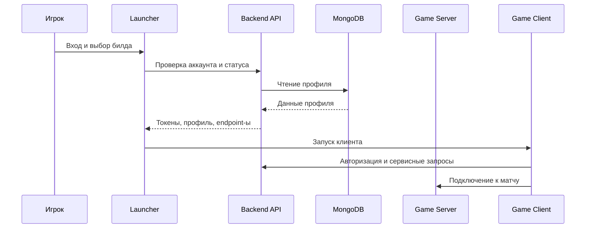

# Архитектура Dream

Dream состоит из трех основных частей: backend, launcher и game server.

## Компоненты

### Backend

Путь: `LawinServerV2-main/`

Зона ответственности:

- аккаунты и авторизация;
- профили игроков;
- друзья и социальные endpoints;
- магазин и catalog responses;
- XMPP;
- matchmaking endpoints;
- конфигурация адресов matchmaker и game server.

Текущий backend написан на Node.js и использует MongoDB.

### Launcher

Путь: `launcher/`

Планируемая зона ответственности:

- авторизация игрока через backend;
- хранение локальных настроек;
- выбор доступного игрового билда;
- проверка файлов;
- запуск клиента с нужной конфигурацией;
- отображение статуса backend и game server.

### Game Server

Путь: `Project-Reboot-3.0-master/`

Зона ответственности:

- серверная логика матча;
- игровые фазы;
- инвентарь, loot, storm, bots и другие игровые системы;
- интеграция с выбранной старой версией клиента.

Проект является C++ workspace для Visual Studio.

## Поток запуска

## Конфигурация

Главные значения backend сейчас находятся в:

- `LawinServerV2-main/Config/config.json`
- `LawinServerV2-main/Config/catalog_config.json`

Для production-like окружения лучше вынести секреты в `.env`, а в репозитории оставить только `.env.example`.

## Открытые вопросы

- Какую старую версию/сезон поддерживаем первой.
- Нужен ли отдельный account dashboard.
- На чем делать launcher: Tauri, Electron, .NET/WPF или native C++.
- Как хранить manifest игровых файлов.
- Какой минимальный сценарий считать MVP: login -> select build -> launch.
