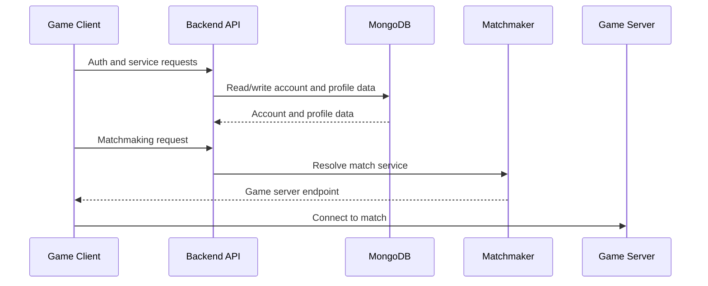

# Architecture

Dream has two components:

- Backend
- Game server

## Backend

Path: `LawinServerV2-main/`

Responsibilities:

- account and auth endpoints;
- player profiles;
- friends and social endpoints;
- store and catalog responses;
- cloud storage endpoints;
- XMPP;
- matchmaking endpoints;
- configuration for matchmaker and game server addresses.

The backend is a Node.js application and uses MongoDB.

## Game Server

Path: `Project-Reboot-3.0-master/`

Responsibilities:

- match server logic;
- game phases;
- inventory;
- loot;
- storm;
- bots;
- gameplay systems tied to supported old client versions.

The game server workspace is a C++ Visual Studio project.

## Runtime Flow

## Configuration

Backend configuration currently lives in:

- `LawinServerV2-main/Config/config.json`
- `LawinServerV2-main/Config/catalog_config.json`
- `LawinServerV2-main/.env.example`

Environment variables are preferred for values that differ per machine:

- `PORT`
- `MONGODB_URI`
- `DISCORD_BOT_TOKEN`

## Open Questions

- Which old Fortnite version/season is the first supported target.
- Which game server build configuration is the baseline.
- Which backend endpoints are required for the first full client flow.
- Which runtime files must be documented for game server operation.
